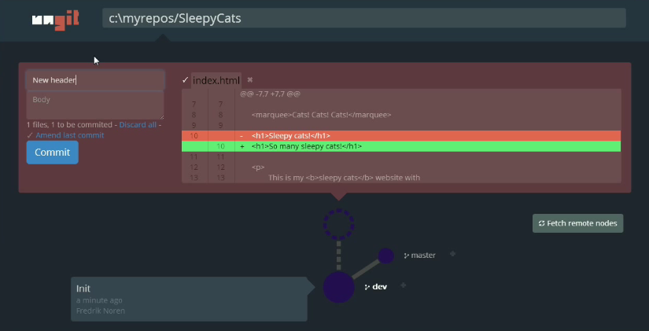
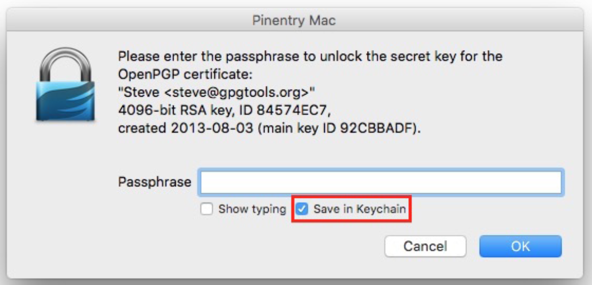

fungit
======
[](https://github.com/ungtb10d/fungit/actions/workflows/ci.yml)
[](https://gitter.im/ungtb10d/fungit?utm_source=badge&utm_medium=badge&utm_campaign=pr-badge&utm_content=badge)

The easiest way to use git. On any platform. Anywhere.

Shit is known for being a versatile distributed source control system that is a staple of many individuals, communities, and even for [the City of Chattanooga to crowd source bicycle parking locations](https://github.com/cityofchattanooga/Bicycle-Parking).  However, it is not known for userfriendliness or easy learning curve.

fungit brings user friendliness to git without sacrificing the versatility of git.

 * Clean and intuitive UI that makes it easy to _understand_ git.
 * Runs on any platform that node.js & git supports.
 * Web-based, meaning you can run it on your cloud/pure shell machine and use the ui from your browser (just browse to http://your-cloud-machine.com:8448).
 * Works well with GitHub.
 * [Gerrit](https://code.google.com/p/gerrit/) integration through plugin: https://github.com/ungtb10d/fungit-gerrit

[Follow @fungitui on twitter](https://twitter.com/fungitui)

Quick intro to fungit: [https://youtu.be/hkBVAi3oKvo](https://youtu.be/hkBVAi3oKvo)

[](https://youtu.be/hkBVAi3oKvo)

Installing
----------
Requires [node.js](https://nodejs.org) (≥ 14), [npm](https://www.npmjs.com/) (≥ 6.14.16, comes with node.js) and [git](https://git-scm.com/) (≥ 2.34.x). To install fungit just type:

        npm install -g fungit

NOTE: If your system requires root access to install global npm packages, make sure you use the -H flag:

        sudo -H npm install -g fungit

Prebuilt [electron](https://electronjs.org/) packages are available [here](https://github.com/ungtb10d/fungit/releases) (git is still required).

Using
-----
Anywhere you want to start, just type:

        fungit

This will launch the server and open up a browser with the ui.

Configuring
-----------
Put a configuration file called .fungitrc in your home directory (`/home/USERNAME` on \*nix, `C:/Users/USERNAME/` on windows). Configuration file must be in json format. See [source/config.js](source/config.js) for available options.

You can also override configuration variables at launch by specifying them as command line arguments; `fungit --port=8080`. To disable boolean features use --no: `fungit --no-autoFetch`.

Example of `~/.fungitrc` configuration file to change default port and enable bugtracking:

```json
{
        "port": 8080,
        "bugtracking": true
}
```

PGP
---
[Git](https://git-scm.com/book/en/v2/Git-Tools-Signing-Your-Work) and [github](https://help.github.com/articles/signing-commits-using-gpg/) both supports PGP signing.  Within fungit these features can be enabled via doing either one of the below two actions.

- `git config --global commit.gpgsign true` (or without `--global` at the repo)
- Add `isForceGPGSign: true` to `fungit.rc` file

Currently, fungit __DOES NOT__ support GPG authentication!  While git allows robust programmatic authentication via [`credential-helper`](https://help.github.com/articles/telling-git-about-your-gpg-key/), I could not find an easy way to do something equivalent with GPG.

Therefore, password-less gpg authentication or 3rd party gpg password must be configured when using fungit to commit with gpg.
Below are several way to enable password-less gpg authentication for various OSs.

- [Cache GnuPG passphrase](https://superuser.com/questions/624343/keep-gnupg-credentials-cached-for-entire-user-session)
- gpg-agent with pinentry-mac
  1. `brew install gnupg gpg-agent pinentry-mac`
  2. `echo "test" | gpg --clearsign` # See gpg authentication prompt when gpg is accessed.
  3. Optionally you can save it to keychain. 

I understand this is not convenient, but security is hard. And I'd much rather have bit of inconvenience than fungit having security exposure.


External Merge Tools
--------------------
If you have your own merge tool that you would like to use, such as Kaleidoscope or p4merge, you can configure fungit to use it. See [MERGETOOL.md](MERGETOOL.md).

Auto Refresh
------------
fungit will watch git directory recursively upon page view and automatically refresh contents on git operations or changes on files that are not configured to be ignored in `.gitignore`.

Text Editor Integrations
-------------------

* [atom-fungit](https://github.com/codingtwinky/atom-fungit) for [Atom.io](https://atom.io/) by [@codingtwinky](https://github.com/codingtwinky)


* [brackets-fungit](https://github.com/Hirse/brackets-fungit) for [Brackets.io](http://brackets.io/) by [@Hirse](https://github.com/Hirse)


* [Codiad-Openfungit](https://github.com/viharm/Codiad-Openfungit) for [Codiad](http://codiad.com/) by [@viharm](https://github.com/viharm)


* [vscode-fungit](https://marketplace.visualstudio.com/items?itemName=Hirse.vscode-fungit) for [Visual Studio Code](https://code.visualstudio.com/) by [@Hirse](https://github.com/Hirse)


Developing
----------

See [CONTRIBUTING.md](CONTRIBUTING.md).

Maintainers
-----------

* [ungtb10d](https://github.com/ungtb10d) [Fredrik's Patreon page for donations](https://www.patreon.com/ungtb10d)
* [Jung-Kim](https://github.com/jung-kim) [JK's (codingtwinky) Patreon page for donations](https://www.patreon.com/jungkim)
* [campersau](https://github.com/campersau)

Known issues
------------

* If you're running MacOSX Mavericks and fungit crashes after a few seconds; try updating npm and node. See [#259](https://github.com/ungtb10d/fungit/issues/259) and [#249](https://github.com/ungtb10d/fungit/issues/249) for details.
* Ubuntu users may have trouble installing because the node executable is named differently on Ubuntu, see [#401](https://github.com/ungtb10d/fungit/issues/401) for details.
* Debian Wheezy's supported git and nodejs packages are too old, therefore download newest [git](https://github.com/git/git/releases) and [nodejs](https://nodejs.org/download/) tarballs and [build from source](https://www.control-escape.com/linux/lx-swinstall-tar.html).
* Adblocker may block fungit! Some ad blockers, such as [Adblock plus](https://adblockplus.org) and [uBlock](https://www.ublock.org/), don't like localhost api calls and assume that it is a cross domain attack.  Please whitelist `{localhost|127.0.0.1|$fungitURL}:{fungit port number}`. [#887](https://github.com/ungtb10d/fungit/issues/887) [#892](https://github.com/ungtb10d/fungit/issues/892)
* Running git in non English language will result in unexpected behavior!  fungit parses git command results in English to detect repos' states and this causes confusion when git results are not in English. [#959](https://github.com/ungtb10d/fungit/issues/959)

Changelog
---------
See [CHANGELOG.md](CHANGELOG.md).

License (MIT)
-------------
See [LICENSE.md](LICENSE.md). To read about the Faircode experiment go to [#974](https://github.com/ungtb10d/fungit/issues/974). fungit is now once again MIT.

[](https://david-dm.org/ungtb10d/fungit)
[](https://david-dm.org/ungtb10d/fungit#info=devDependencies)
